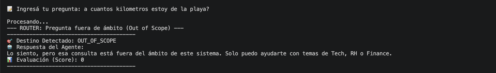
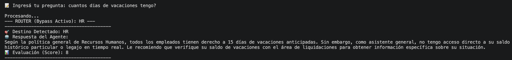
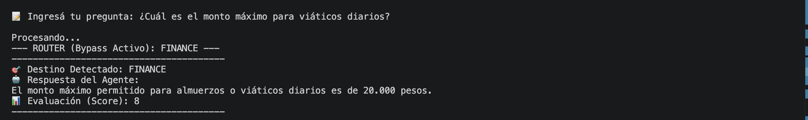
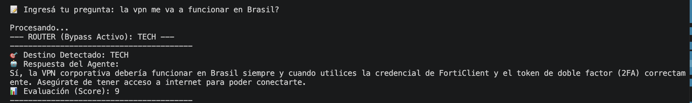
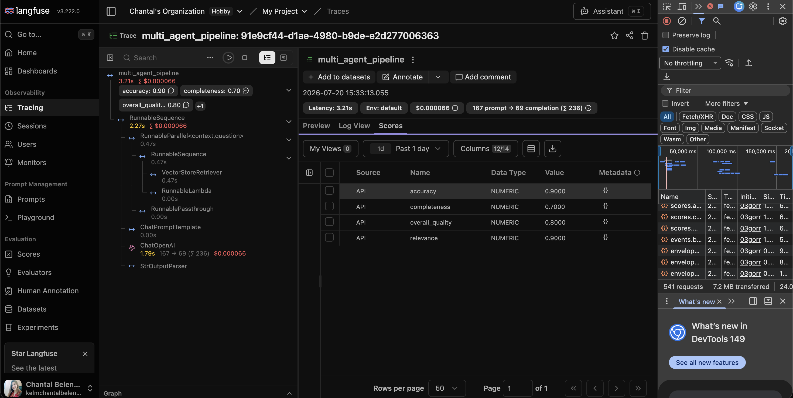

# 🤖 Proyecto Integrador 3: Sistema Multiagente RAG con Evaluación Automática

Un sistema multiagente inteligente, modular y estructurado en scripts de Python diseñado para responder consultas corporativas especializadas de **Recursos Humanos (RH)**, **Finanzas (Finance)** y **Soporte Técnico (Tech)** mediante arquitectura RAG (*Retrieval-Augmented Generation*), monitoreo continuo con Langfuse y evaluación automática.


## 🏛️ Arquitectura del Sistema

El flujo de procesamiento está diseñado bajo principios de modularidad, eficiencia en consumo de tokens y separación de responsabilidades:

```text
                               ┌──────────────────────────┐
                               │     Entrada Usuario      │
                               └────────────┬─────────────┘
                                            │
                                            ▼
                             ┌──────────────────────────────┐
                             │ Router / Out-of-Scope Filter │
                             └──────────────┬───────────────┘
                                            │
                  ┌─────────────────────────┼─────────────────────────┐
                  │                         │                         │
            (Coincide HR)            (Coincide Tech)          (Coincide Finance)
                  │                         │                         │
                  ▼                         ▼                         ▼
         ┌─────────────────┐       ┌─────────────────┐       ┌─────────────────┐
         │    HR Agent     │       │   Tech Agent    │       │  Finance Agent  │
         │ (RAG: hr_docs)  │       │ (RAG: tech_docs)│       │ (finance_docs)  │
         └────────┬────────┘       └────────┬────────┘       └────────┬────────┘
                  │                         │                         │
                  └─────────────────────────┼─────────────────────────┘
                                            │
                                            ▼
                             ┌──────────────────────────────┐
                             │      Respuesta del Agente    │
                             └──────────────┬───────────────┘
                                            │
                                            ▼
                             ┌──────────────────────────────┐
                             │    Evaluador de Calidad      │
                             │      (src/evaluator.py)      │
                             └──────────────┬───────────────┘
                                            │
                  ┌─────────────────────────┴─────────────────────────┐
                  │                                                   │
                  ▼                                                   ▼
   ┌──────────────────────────────┐                    ┌──────────────────────────────┐
   │ Salida Consola / Usuario     │                    │  Langfuse / Logger Local     │
   │ (Respuesta + Score)          │                    │     (results_log.json)       │
   └──────────────────────────────┘                    └──────────────────────────────┘
```

## 🚀 Requisitos Previos e Instalación

## Requisitos de Entorno

```text
Python: >= 3.11, < 3.13
```

Instalación de Dependencias
Podés instalar las dependencias fijadas en requirements.txt mediante pip o el gestor uv:

## Con uv (Recomendado)

```text
uv pip install -r requirements.txt
```

## Con pip tradicional

```text
pip install -r requirements.txt
```

## Configuración de Variables de Entorno (API Keys)
Crea un archivo .env en la raíz del proyecto basándote en .env.example:

```text
OPENAI_API_KEY=tu_openai_api_key
LANGFUSE_PUBLIC_KEY=tu_public_key
LANGFUSE_SECRET_KEY=tu_secret_key
LANGFUSE_HOST=https://us.cloud.langfuse.com
```

## 🖥️ Ejecución del Proyecto
1. Interfaz Interactiva CLI (Terminal)
Para iniciar el sistema multiagente de forma interactiva en la terminal:

```text
python -m src.multi_agent_system
```

2. Importación como Módulo
Al estar desarrollado como un paquete modular en la carpeta src/, también se puede importar la función principal run_pipeline desde cualquier otro script de Python:

```text
from src.multi_agent_system import run_pipeline
```

# Invocación directa del pipeline completo

```text
resultado = run_pipeline("¿Cuántos días de vacaciones tengo?")
print(resultado)
```

# 💡 Ejemplos de Uso

## 1. Pruebas Interactivas en Consola

| Tipo de Consulta | Ejemplo de Pregunta | Agente Asignado | Comportamiento |
| :--- | :--- | :--- | :--- |
| **Recursos Humanos** | *"¿Cuántos días de vacaciones tengo?"* | `HR` | Consulta RAG de políticas de RRHH e informa limitación de legajo en tiempo real. |
| **Finanzas** | *"¿Cuál es la fecha límite para rendir los gastos de viáticos?"* | `FINANCE` | Consulta RAG sobre políticas de gastos y reembolsos corporativos. |
| **Soporte Técnico** | *"No me funciona la VPN de la empresa"* | `TECH` | Consulta RAG de guías técnicas y soporte. |
| **Out of Scope** | *"¿Cuál es la playa más linda?"* | `OUT_OF_SCOPE` | Filtrado instantáneo a costo $0$ de tokens con respuesta de ámbito estática. |

---

## Ejemplo de consulta `OUT_OF_SCOPE`



## Ejemplo de consulta `HR`



## Ejemplo de consulta `FINANCE`



## Ejemplo de consulta `TECH`



### 📊 Registro de Auditoría Multidimensional (`results_log.json`)

Mientras la consola muestra una salida limpia y rápida para el usuario, cada consulta guarda automáticamente una auditoría multidimensional completa en `results_log.json`:

```json
{
  "timestamp": "2026-07-19T22:07:30.615035",
  "question": "cuantos dias de vacaciones tengo?",
  "destination": "hr",
  "response": "Según la política general de Recursos Humanos, todos los empleados tienen derecho a 15 días de vacaciones...",
  "evaluation": {
    "score_general": 8,
    "dimensiones": {
      "relevancia": 9,
      "completitud": 7,
      "fidelidad": 9
    },
    "justificacion": "La respuesta es relevante ya que aborda directamente la consulta general sobre vacaciones..."
  }
}
```

---

## 📊 Observabilidad y Evaluación con Langfuse

El sistema integra **Langfuse** para el monitoreo continuo, trazabilidad de llamadas a los agentes y evaluación automatizada de la calidad de las respuestas (RAG Triad).

### 🔍 Agente Evaluador (`src/evaluator.py`)
Cada respuesta generada por los agentes especializados es auditada automáticamente por un modelo de lenguaje evaluador (`gpt-4o-mini`) que calcula puntajes en una escala de 0 a 1 (o 1 a 10) en tres dimensiones clave:

* **Relevancia (`relevance`)**: Evalúa si la respuesta aborda directamente la pregunta del usuario.
* **Completitud (`completeness`)**: Mide si la respuesta brinda toda la información necesaria de forma exhaustiva.
* **Fidelidad (`accuracy`)**: Verifica que la respuesta se mantenga fiel al contexto de las políticas de la empresa sin alucinar datos.
* **Calidad General (`overall_quality`)**: Ponderación global del desempeño del agente en la consulta.

Los resultados son enviados en tiempo real a Langfuse utilizando la **Score API** vinculados a la traza principal `multi_agent_pipeline`.



## ⚙️ Notas de Configuración y Decisiones Técnicas

* **Manejo de Out-of-Scope:** El filtro por intenciones/palabras clave en la etapa del router evita invocar agentes RAG o llamadas innecesarias a la API cuando las consultas son ajenas al dominio corporativo, retornando un Score de 0 y ahorrando tokens.

* **Persistencia e Historial Completo:** Todas las ejecuciones se guardan de forma acumulativa en `results_log.json` sin sobrescribir pruebas anteriores. Para mantener la interfaz CLI limpia en consola, el detalle profundo de la auditoría que incluye el desglose de dimensiones (`relevancia`, `completitud`, `fidelidad`) y la `justificacion` narrativa del evaluador se almacena de forma estructurada en este archivo de registros.

* **Trazabilidad con Langfuse:** Cada ejecución envía los metadatos y el trace_id al dashboard de Langfuse para monitoreo y auditoría en tiempo real.

## 📁 Estructura del Proyecto

```text
.
├── data/                       # Documentación corporativa (HR, Tech, Finance)
│   ├── finance_docs/
│   ├── hr_docs/
│   └── tech_docs/
├── src/
│   ├── agents/                 # Agentes especializados por módulo
│   │   ├── finance_agent.py
│   │   ├── hr_agent.py
│   │   ├── orchestrator.py
│   │   └── tech_agent.py
│   ├── evaluator.py            # Auditor externo de calidad
│   └── multi_agent_system.py   # Orquestador principal, Router y CLI
├── .env.example
├── pyproject.toml              # Especificación del proyecto y versión de Python
├── requirements.txt            # Dependencias fijadas para reproducibilidad
├── results_log.json            # Historial acumulativo de ejecuciones
└── README.md
