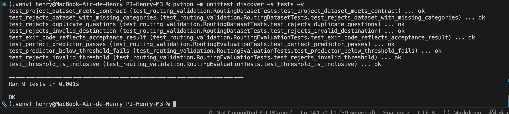
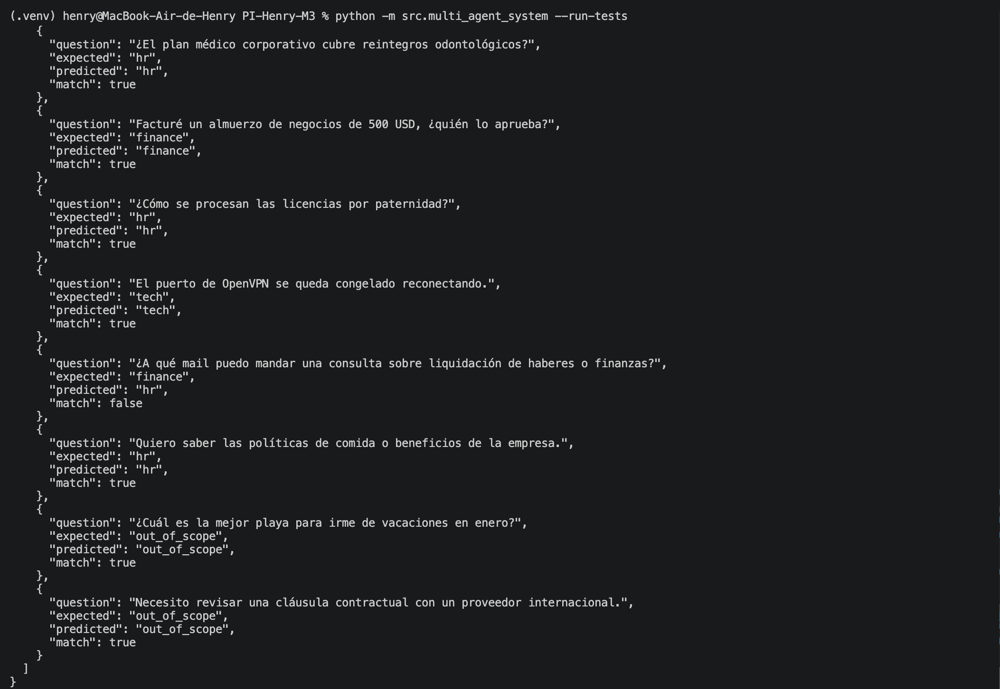
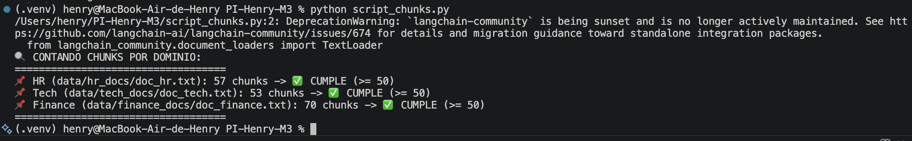
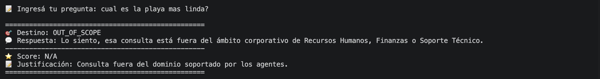
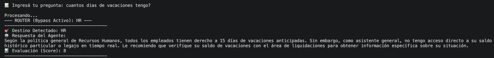
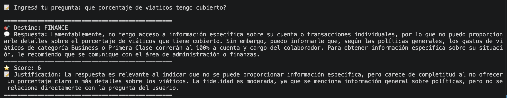
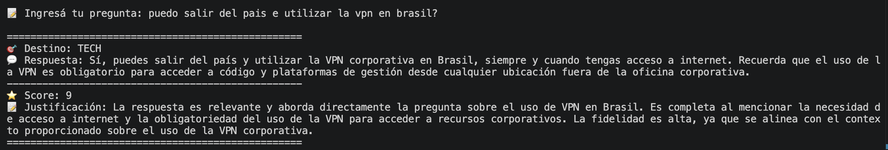
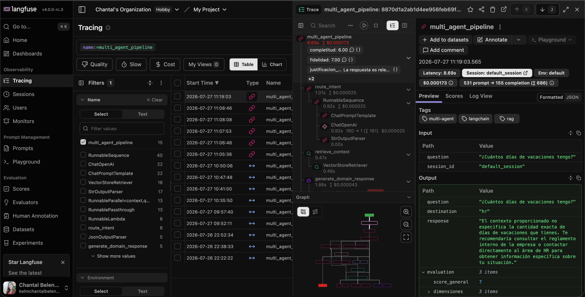

# 🤖 Proyecto Integrador 3: Sistema Multiagente RAG con Evaluación Automática

Sistema modular para responder consultas corporativas de **Recursos Humanos
(HR)**, **Finanzas (Finance)** y **Soporte Técnico (Tech)** mediante RAG
(*Retrieval-Augmented Generation*), routing con LangChain, trazabilidad opcional
con Langfuse y evaluación automática de las respuestas.


## 🏛️ Arquitectura del Sistema

El flujo separa clasificación, recuperación, generación y evaluación:

```text
Usuario
  │
  ▼
Router LLM
  ├── HR ───────► Retriever HR ───────┐
  ├── Tech ─────► Retriever Tech ─────┼──► Generación ─► Evaluador
  ├── Finance ──► Retriever Finance ──┘
  └── Out of scope ──────────────────────► Respuesta estática

Resultado ─► CLI + results_log.json
          └► Langfuse, si está configurado
```

Para las consultas soportadas se realiza una única recuperación. Ese mismo
contexto se utiliza para generar la respuesta y para evaluarla.

## 🚀 Requisitos Previos e Instalación

### Requisitos de entorno

```text
Python: >= 3.11, < 3.13
```

Las dependencias directas están fijadas en `requirements.txt` y
`pyproject.toml`. Podés instalarlas mediante pip o el gestor uv:

### Con uv

```bash
uv pip install -r requirements.txt
```

### Con pip

```bash
pip install -r requirements.txt
```

### Configuración de variables de entorno

Creá un archivo `.env` en la raíz basándote en `.env.example`:

```text
OPENAI_API_KEY=tu_openai_api_key
LANGFUSE_PUBLIC_KEY=tu_public_key
LANGFUSE_SECRET_KEY=tu_secret_key
LANGFUSE_HOST=https://cloud.langfuse.com
```

## 🖥️ Ejecución del proyecto

Ejecutá los comandos desde la raíz del repositorio. El entrypoint soportado es
el módulo `src.multi_agent_system`.

### Interfaz interactiva

```text
python -m src.multi_agent_system
```

### Importación como módulo

También se puede importar la función principal:

```text
from src.multi_agent_system import run_pipeline
```

### Invocación directa del pipeline completo

Esta invocación no se pega directamente en `zsh` o `bash`, porque `run_pipeline(...)` es código Python. Tenés tres formas correctas de ejecutarlo:

**Opción 1: REPL de Python**

```text
python
```

Y después, dentro del intérprete:

```python
from src.multi_agent_system import run_pipeline
resultado = run_pipeline("¿Cuántos días de vacaciones tengo?")
print(resultado)
```

**Opción 2: One-liner desde terminal**

```text
python -c 'from src.multi_agent_system import run_pipeline; print(run_pipeline("¿Cuántos días de vacaciones tengo?"))'
```

**Opción 3: Script Python aparte**

```python
from src.multi_agent_system import run_pipeline

resultado = run_pipeline("¿Cuántos días de vacaciones tengo?")
print(resultado)
```

### Validación automática del routing

La validación está separada en dos niveles.

Para ejecutar los tests deterministas del contrato del dataset y del cálculo de
métricas, sin API keys ni llamadas externas:

```text
python -m unittest discover -s tests -v
```


Para ejecutar la prueba de aceptación contra el router LLM real:

```text
python -m src.multi_agent_system --run-tests
```

La prueba live utiliza las consultas de `test_queries.json`, requiere
`OPENAI_API_KEY` y exige una precisión mínima del 90%. El resumen incluye
`status`, `meets_threshold`, precisión, cobertura y detalle por consulta. El
comando devuelve exit code `1` si el router no alcanza el umbral, por lo que
puede utilizarse como gate de CI.



### Verificación de chunking por dominio
Para comprobar que cada colección documental supera el mínimo de 50 chunks exigido por la consigna:

```text
python script_chunks.py
```

Este script reutiliza los parámetros del pipeline y muestra por consola la
cantidad de chunks: HR 57, Tech 53 y Finance 70 con los documentos actuales.



# 💡 Ejemplos de Uso

## 1. Pruebas Interactivas en Consola

| Tipo de Consulta | Ejemplo de Pregunta | Agente Asignado | Comportamiento |
| :--- | :--- | :--- | :--- |
| **Recursos Humanos** | *"¿Cuántos días de vacaciones tengo?"* | `HR` | Consulta RAG de políticas de RRHH e informa limitación de legajo en tiempo real. |
| **Finanzas** | *"¿Cuál es la fecha límite para rendir los gastos de viáticos?"* | `FINANCE` | Consulta RAG sobre políticas de gastos y reembolsos corporativos. |
| **Soporte Técnico** | *"No me funciona la VPN de la empresa"* | `TECH` | Consulta RAG de guías técnicas y soporte. |
| **Out of Scope** | *"¿Cuál es la playa más linda?"* | `OUT_OF_SCOPE` | El router consume una llamada LLM, pero se omiten retrieval, generación RAG y evaluación. |

---

## Ejemplo de consulta `OUT_OF_SCOPE`



## Ejemplo de consulta `HR`



## Ejemplo de consulta `FINANCE`



## Ejemplo de consulta `TECH`



### 📊 Registro de Auditoría Multidimensional (`results_log.json`)

Cada ejecución del pipeline guarda pregunta, destino, respuesta y estado de
evaluación en `results_log.json`:

```json
{
  "timestamp": "2026-07-19T22:07:30.615035",
  "question": "cuantos dias de vacaciones tengo?",
  "destination": "hr",
  "response": "Los días dependen de la antigüedad: 14, 21, 28 o 35 días corridos según el tramo aplicable.",
  "evaluation": {
    "status": "evaluated",
    "score_general": 8.33,
    "dimensiones": {
      "relevancia": 9,
      "completitud": 7,
      "fidelidad": 9
    },
    "justificacion": "La respuesta es relevante ya que aborda directamente la consulta general sobre vacaciones..."
  }
}
```

---

## 📊 Observabilidad y Evaluación con Langfuse

Cuando las tres variables de Langfuse están configuradas, el sistema exporta
trazas de las llamadas a los agentes y los resultados de la evaluación.

### 🔍 Agente Evaluador (`src/evaluator.py`)
Cada respuesta generada por los agentes especializados es auditada automáticamente por un modelo de lenguaje evaluador (`gpt-4o-mini`). La salida se valida mediante un schema Pydantic estricto que solo acepta enteros de 1 a 10 en tres dimensiones:

* **Relevancia (`relevance`)**: Evalúa si la respuesta aborda directamente la pregunta del usuario.
* **Completitud (`completeness`)**: Mide si la respuesta brinda toda la información necesaria de forma exhaustiva.
* **Fidelidad (`accuracy`)**: Verifica que la respuesta se mantenga fiel al contexto de las políticas de la empresa sin alucinar datos.
* **Calidad General (`score_general`)**: promedio aritmético calculado en Python a partir de las tres dimensiones validadas.

Una evaluación correcta retorna `status: evaluated`. Si el modelo evaluador, el parser o el proveedor fallan, retorna `status: evaluation_error` y scores nulos en vez de inventar una calificación neutral. Las consultas `out_of_scope` usan `status: not_applicable`, ya que no generan una respuesta RAG.

Los resultados válidos se registran en Langfuse utilizando la **Score API** sobre la traza principal `multi_agent_pipeline`, creando scores numéricos para `score_general`, `relevancia`, `completitud` y `fidelidad`, además de un score de texto con la justificación. Los errores técnicos se registran por separado mediante `evaluation_succeeded` y `evaluation_error`.



## ⚙️ Notas de Configuración y Decisiones Técnicas

* **Routing con LangChain:** El orquestador usa `ChatPromptTemplate` +
  `ChatOpenAI` + `StrOutputParser`. La selección posterior del agente se realiza
  mediante control de flujo Python.

* **RAG especializado por dominio:** Cada agente carga su colección, aplica
  `RecursiveCharacterTextSplitter`, genera embeddings con
  `OpenAIEmbeddings` e indexa en `InMemoryVectorStore`. La construcción es lazy:
  el primer acceso a un dominio crea su agente y los accesos posteriores
  reutilizan la misma cadena, retriever e índice durante la vida del proceso.

* **Chunking explícito y verificable:** Se usan `chunk_size=200` y
  `chunk_overlap=40`. Esta configuración permite superar el mínimo solicitado,
  pero no constituye por sí sola una validación de calidad semántica.

* **Trazabilidad con Langfuse:** El pipeline, router, retrieval, generación y
  evaluator están instrumentados como observaciones independientes. Las
  invocaciones internas se exportan mediante `CallbackHandler` cuando Langfuse
  está habilitado y el callback se inicializa correctamente.

* **Evaluación automática con Score API:** Solo las evaluaciones con
  `status: evaluated` generan scores numéricos. Los fallos técnicos y casos no
  aplicables se registran por separado.

* **Persistencia local complementaria:** En ejecución secuencial, cada llamada
  agrega una entrada a `results_log.json`. Es un registro de demostración, no
  una base de auditoría transaccional.

## ⚠️ Limitaciones conocidas

* El sistema soporta únicamente HR, Tech y Finance. Consultas legales u otros
  dominios se clasifican como `out_of_scope`.
* Cada dominio contiene actualmente un único documento sintético. Esto alcanza
  el mínimo de chunks, pero no representa el volumen ni la diversidad de una
  base corporativa real.
* El cargador admite `.txt`, `.md` y `.csv`. Los archivos PDF todavía no están
  soportados.
* La caché de agentes vive únicamente en memoria. Al reiniciar el proceso se
  reconstruyen los índices; tampoco existe invalidación automática si los
  documentos cambian mientras el proceso está activo. En ese caso debe
  reiniciarse el servicio o invalidarse explícitamente la caché del agente.
* El retrieval usa similitud vectorial con `k=2`, sin umbral, reranking,
  búsqueda híbrida ni citas en la respuesta.
* El evaluator juzga la respuesta contra el contexto recuperado. No puede
  detectar por sí solo que el retriever omitió un fragmento relevante presente
  en el corpus completo.
* El score se registra y se devuelve, pero actualmente no bloquea ni deriva una
  respuesta de baja calidad.
* Tanto el router como el evaluator dependen de OpenAI. La prueba live consume
  API y sus resultados pueden variar aunque `temperature=0`.
* Langfuse es opcional. Sin credenciales, o si falla la inicialización del
  callback, no se exportan todos los detalles internos de LangChain.
* `results_log.json` guarda texto sin redacción de PII, locking, rotación ni
  protección para escrituras concurrentes. No debe usarse con datos sensibles
  reales en su forma actual.
* Las dependencias directas están fijadas, pero no existe un lockfile para las
  dependencias transitivas.
* Las entradas ya presentes en `results_log.json` son ejecuciones históricas y
  pueden usar el contrato anterior del evaluator, sin el campo `status`.
* `main.py` es un placeholder heredado; no es el entrypoint del sistema.

## ✅ Cobertura de Entregables

* **Main notebook / múltiples archivos:** Implementación modular en `src/multi_agent_system.py`, `src/agents/orchestrator.py`, `src/agents/hr_agent.py`, `src/agents/tech_agent.py`, `src/agents/finance_agent.py` y `src/evaluator.py`.
* **Colecciones de documentos:** HR 57, Tech 53 y Finance 70 chunks con la configuración y corpus actuales.
* **Test queries:** `test_queries.json` contiene 12 consultas y cubre `hr`, `tech`, `finance` y `out_of_scope`.
* **README:** incluye descripción del proyecto, instalación, configuración, ejecución, pruebas, decisiones técnicas y limitaciones.

## 📁 Estructura del Proyecto

```text
.
├── data/                       # Documentación corporativa (HR, Tech, Finance)
│   ├── finance_docs/
│   ├── hr_docs/
│   └── tech_docs/
├── src/
│   ├── agents/                 # Agentes especializados por módulo
│   │   ├── document_loader.py  # Carga validada de las colecciones
│   │   ├── finance_agent.py
│   │   ├── hr_agent.py
│   │   ├── orchestrator.py
│   │   └── tech_agent.py
│   ├── evaluator.py            # Auditor externo de calidad
│   ├── langfuse_utils.py       # Configuración de trazas y callbacks
│   └── multi_agent_system.py   # Orquestador principal, Router y CLI
├── tests/                      # Tests deterministas sin servicios externos
│   ├── test_agent_caching.py
│   ├── test_evaluator.py
│   └── test_routing_validation.py
├── .env.example
├── main.py                     # Placeholder heredado; no es el entrypoint
├── script_chunks.py            # Conteo verificable por dominio
├── test_queries.json           # Dataset de aceptación del router
├── pyproject.toml              # Especificación del proyecto y versión de Python
├── requirements.txt            # Dependencias directas fijadas
├── results_log.json            # Historial local de demostración
└── README.md
```
